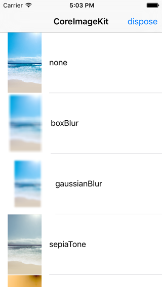
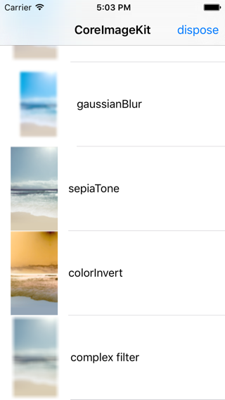

# CoreImageKit

[English Version](https://github.com/huangxinping/CoreImageKit)


### 前言

如果没有意外的话，在所有Apple提供的SDK中，**CoreImage**应该是最难使用的了！

正常情况下，我们需要写如下代码：

```
let vignette = CIFilter(name:"CIVignette")
vignette.setValue(composite.outputImage, forKey:kCIInputImageKey)
vignette.setValue(intensity * 2, forKey:"inputIntensity")
vignette.setValue(intensity * 30, forKey:"inputRadius")
```

这就是Apple给我们的方式，对于我们来说应用任意一个滤镜，我们都得拼写正确滤镜名称、参数名称！我的个天，实际编程过程中，老是犯字符串拼写错误的，所以某一天当我们这样编写程序时：

```

// boxBlur滤镜
let filterImage = CIImage(image: UIImage(named: "origin")!)?.boxBlur({ (radius) in
	radius = 70
})?.toUIImage

// 混合滤镜
let complex = CIImage(image: UIImage(named: "origin")!)?.boxBlur({ (radius) in
	radius = 70
})?.sepiaTone({ (intensity) in
	intensity = 0.5
})?.toUIImage

```

我想我们应该会减少很多本来可以避免的错误吧，`CoreImageKit`就是为此而生！


使用效果：





### 功能
支持如下滤镜：

```
bumpDistortion
bumpDistortionLinear
circleSplashDistortion
circularWrap
displacementDistortion
droste
glassDistortion
glassLozenge
holeDistortion
lightTunnel
pinchDistortion
stretchCrop
torusLensDistortion
twirlDistortion
vortexDistortion
affineTransform
crop
lanczosScaleTransform
perspectiveCorrection
perspectiveTransform
perspectiveTransformWithExtent
straightenFilter
additionCompositing
colorBlendMode
colorBurnBlendMode
colorDodgeBlendMode
darkenBlendMode
differenceBlendMode
divideBlendMode
exclusionBlendMode
hardLightBlendMode
hueBlendMode
lightenBlendMode
linearBurnBlendMode
linearDodgeBlendMode
luminosityBlendMode
maximumCompositing
minimumCompositing
multiplyBlendMode
multiplyCompositing
overlayBlendMode
pinLightBlendMode
saturationBlendMode
screenBlendMode
softLightBlendMode
sourceAtopCompositing
sourceInCompositing
sourceOutCompositing
sourceOverCompositing
subtractBlendMode
circularScreen
cMYKHalftone
dotScreen
hatchedScreen
lineScreen
colorClamp
colorControls
colorMatrix
colorPolynomial
exposureAdjust
gammaAdjust
hueAdjust
linearToSRGBToneCurve
sRGBToneCurveToLinear
temperatureAndTint
toneCurve
vibrance
whitePointAdjust
colorCrossPolynomial
colorCube
colorCubeWithColorSpace
colorInvert
colorMap
colorMonochrome
colorPosterize
falseColor
maskToAlpha
maximumComponent
minimumComponent
photoEffectChrome
photoEffectFade
photoEffectInstant
photoEffectMono
photoEffectNoir
photoEffectProcess
photoEffectTonal
photoEffectTransfer
sepiaTone
vignette
vignetteEffect
accordionFoldTransition
barsSwipeTransition
copyMachineTransition
disintegrateWithMaskTransition
dissolveTransition
flashTransition
modTransition
pageCurlTransition
pageCurlWithShadowTransition
rippleTransition
swipeTransition
affineClamp
affineTile
eightfoldReflectedTile
fourfoldReflectedTile
fourfoldRotatedTile
fourfoldTranslatedTile
glideReflectedTile
kaleidoscope
opTile
parallelogramTile
perspectiveTile
sixfoldReflectedTile
sixfoldRotatedTile
triangleKaleidoscope
triangleTile
twelvefoldReflectedTile
aztecCodeGenerator
checkerboardGenerator
code128BarcodeGenerator
constantColorGenerator
lenticularHaloGenerator
pDF417BarcodeGenerator
qRCodeGenerator
randomGenerator
starShineGenerator
stripesGenerator
sunbeamsGenerator
areaAverage
areaHistogram
areaMaximum
areaMaximumAlpha
areaMinimum
areaMinimumAlpha
columnAverage
histogramDisplayFilter
rowAverage
gaussianGradient
linearGradient
radialGradient
smoothLinearGradient
blendWithAlphaMask
blendWithMask
bloom
comicEffect
convolution3X3
convolution5X5
convolution7X7
convolution9Horizontal
convolution9Vertical
crystallize
depthOfField
edges
edgeWork
gloom
heightFieldFromMask
hexagonalPixellate
highlightShadowAdjust
lineOverlay
pixellate
pointillize
shadedMaterial
spotColor
spotLight
sharpenLuminance
unsharpMask
boxBlur
discBlur
gaussianBlur
maskedVariableBlur
medianFilter
motionBlur
noiseReduction
zoomBlur
```

### 生成
`CoreImageKit`所有的滤镜方法都是通过[自动化工具](https://github.com/huangxinping/CoreImageKit/tree/master/CIRobot)生成！

### 使用

With Carthage:
```
github "huangxinping/CoreImageKit" >= 1.0.0
```
